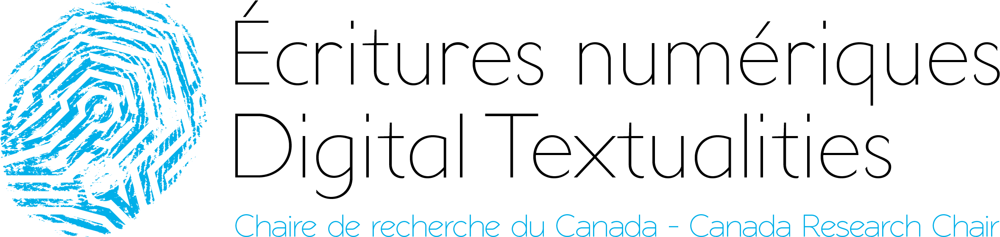

<!-- .slide: data-background-image="" -->
<!-- .slide: class="hover"-->

## Le répertoire des écrivains et des écrivaines. Archiving and institutionalization of digital literature

Enrico Agostini-Marchese, Servanne Monjour, Nicolas Sauret et Marcello Vitali-Rosati   CRC sur les écritures numériques   Université de Montréal
 
Colloque _ELO 2018. Mind the gap_
 Montréal - August 2018

 <!-- .element: class="logo" style="width:30%; background-color:ghostwhite;padding: 5px" -->

<!-- .element: style="font-size:1.4rem" -->

 <!-- .element: class="logo" -->

%%%%%%%%%%%%%%%%%%%%%%%%%%%%%%%%%%%%%%%%%%%%%
